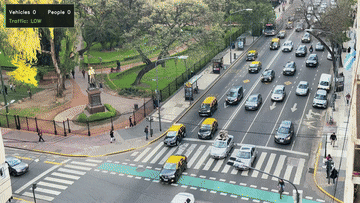

<p align="center">
  
</p>

<h1 align="center">Loop Computer Vision</h1>

<p align="center">
Real-time vehicle & pedestrian tracking with live traffic congestion classification.
</p>

<p align="center">
  <a href="https://github.com/felipebridge/loop-computer-vision/actions/workflows/ci.yml"></a>
  <a href="pyproject.toml"></a>
  <a href="LICENSE"></a>
</p>

<p align="center">
  
</p>

## What it does

Tracks vehicles and pedestrians in traffic video (each counted once, not once per frame),
classifies congestion as LOW / MODERATE / HIGH, and renders an annotated video plus a
Streamlit dashboard over the results.

## Quickstart

```bash
python -m venv .venv && source .venv/bin/activate   # .venv\Scripts\activate on Windows
pip install -e ".[dev]"

python -m traffic_intelligence run --input data/raw/avenue.mp4
python -m traffic_intelligence dashboard
```

## Configuration

`configs/default.yaml` ships with general-purpose defaults (model size, detection resolution,
congestion thresholds) meant to run reasonably on typical hardware, CPU included. Traffic density
in particular is scene-dependent — a 6-lane avenue and a quiet side street don't hit "busy" at the
same vehicle count — so after your first run, check `outputs/analytics/tracks.csv` (or
`summary.json`) and adjust `congestion.density_thresholds` in your own copy of the config (`--config
path/to/yours.yaml`) so LOW/MODERATE/HIGH line up with what your footage actually shows. Each
setting in the file is commented with what it trades off.

## Stack

Python 3.11+ · Ultralytics YOLO (ByteTrack/BoT-SORT) · OpenCV · Pydantic · Pandas ·
Streamlit/Altair · pytest

## Status

This project is actively being developed and improved. If you're interested in contributing, see [CONTRIBUTING.md](CONTRIBUTING.md) or reach out at felibridge49@gmail.com.

## License

MIT 


